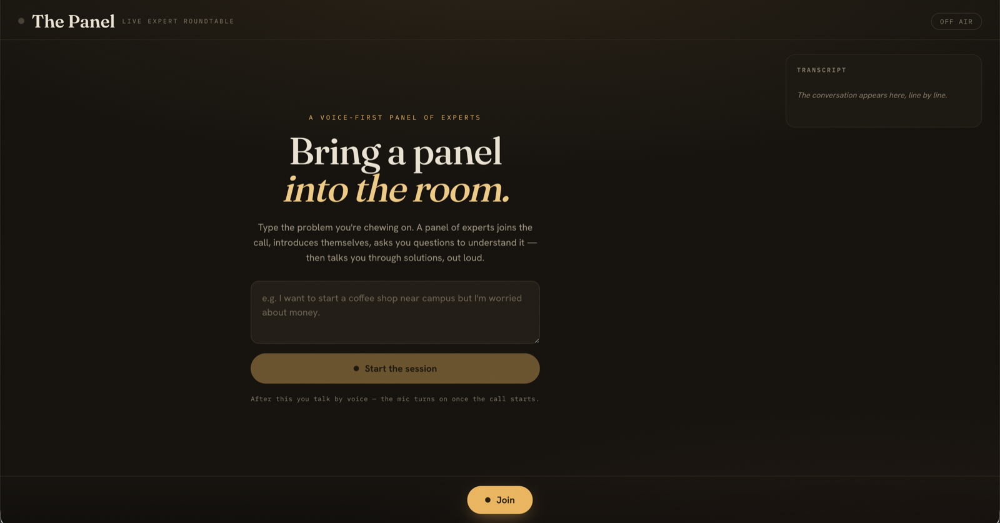
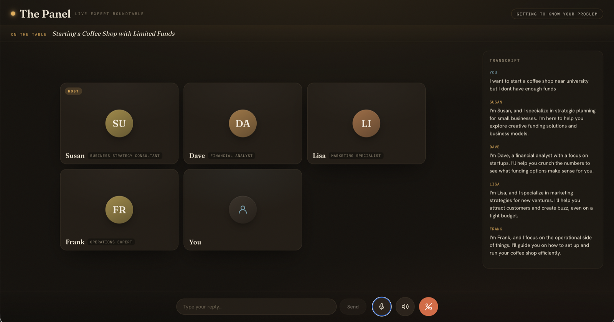

<div align="center">

# 🎙️ The Panel

### An AI expert panel that joins your call.

*Describe a problem. An AI assembles a small panel of experts who join a Google-Meet-style call,
interview you one question at a time, and talk you through tailored solutions — in real-time voice.*

<br/>

`React` · `Vite` · `Pipecat` · `FastAPI` · `WebRTC` · `Deepgram` · `OpenAI` · `Cartesia`

</div>

---

## Screenshots

<div align="center">

**Start a session** — describe your problem, and the panel forms around it.



<br/><br/>

**The live panel** — experts join the call, take turns, and the active speaker lights up.



</div>

---

## What is The Panel?

Most AI tools hand you a single answer. When you're actually wrestling with a decision — starting
a business, taking a job, planning a trip — you want to **talk it through with people who know
things**, who ask the right questions and challenge each other.

**The Panel** does that. You type a problem and an AI instantly builds a panel of **3–4 experts**
who join a call like a video meeting. They introduce themselves in distinct voices, **ask you
clarifying questions one at a time**, listen to your answers, and then walk you through concrete,
tailored solutions — agreeing and disagreeing like real people in a room. You always see who's
speaking, you can interrupt anytime, and you finish with a written recap.

> It isn't a chatbot with a microphone. It's a **panel that interviews you** — agents share one
> conversation, build on each other's questions and your answers, and take strict turns so no one
> talks over anyone.

---

## Features

- 🧠 **Dynamic panel** — 3–4 experts generated to fit *your* problem, each with a name, role,
  personality, and a distinct voice.
- 🟦 **Google-Meet-style UI** — participant tiles, a glowing border on the active speaker, a
  "listening" state on the rest, live captions, and a running transcript.
- 🎯 **Smart, coherent interview** — a "director" decides who asks next, keeps one expert on a
  coherent thread, builds on your answers, and stops once it knows enough.
- 🗣️ **Strict turn-taking** — exactly one voice at a time, gated on real audio playback. No
  overlapping speech.
- ⏳ **Respects you** — a deliberate pause after you speak so you can finish your thought; barge-in
  lets you interrupt anytime.
- 🤐 **Only relevant experts speak** — agents stay quiet when they have nothing useful to add.
- 🌐 **Robust real-time voice** — WebRTC straight to the backend, survives reconnects, no media
  server to run.
- 📝 **Written recap** — key points, where they disagreed, and suggested next steps.

---

## Architecture

```
┌──────────────────────────────┐        WebRTC         ┌─────────────────────────────────────────────┐
│   Browser (React + Vite)     │  audio + data channel │        Backend (FastAPI + Pipecat)            │
│                              │ ◄───────────────────► │                                               │
│  • types the problem         │                       │  transport.input()                            │
│  • Meet-style tile grid      │                       │    → RTVI (client/server messages)            │
│  • plays agent audio         │                       │    → VAD (Silero)         [barge-in]          │
│  • shows who's speaking      │                       │    → STT (Deepgram, streaming)                │
│  • live captions + transcript│                       │    → PanelProcessor  ◄── the orchestrator     │
│  • mic mute / leave          │                       │         • create panel (OpenAI)               │
│                              │                       │         • director: who asks next + what       │
│                              │                       │         • switch voice per agent (Cartesia)   │
│                              │                       │         • strict turn-taking + debounce       │
│                              │                       │    → TTS (Cartesia, multi-voice)              │
│                              │                       │    → transport.output()                       │
└──────────────────────────────┘                       └─────────────────────────────────────────────┘
```

The pipeline, built per connection:
`transport.input() → RTVI → VAD → STT → PanelProcessor → TTS → transport.output()`.

The "multiple people" effect comes from **one** brain and **one** pipeline — the orchestrator
switches persona + Cartesia voice per utterance.

---

## Tech stack

| Layer | Choice | Why |
|-------|--------|-----|
| Voice pipeline | **Pipecat** (Python) | VAD, interruption, WebRTC transport, and the message channel out of the box |
| Transport | **WebRTC** via **SmallWebRTC** | Real-time browser audio, **no third-party media server** |
| Speech-to-text | **Deepgram** `nova-2` (streaming) | Fast, accurate "ears" with interim results |
| Brain | **OpenAI** GPT-4o | Builds the panel, directs the questioning, writes solutions/recap (strict JSON) |
| Text-to-speech | **Cartesia** `sonic-2` (multi-voice) | Low latency + many **distinct** voices |
| Voice activity | **Silero VAD** | Detects speech for barge-in |
| Frontend | **React + Vite** | Fast UI, hot reload |
| Client SDK | **@pipecat-ai/client-js** | WebRTC handshake, audio, mic, messaging |

---

## How it works

The meeting runs as a small state machine:

`await_problem → assembling → intros → clarifying → solving → recap`

1. **You type the problem** and click *Start meeting*.
2. **Assembling** — OpenAI builds 3–4 agents tailored to the problem; one is the facilitator.
3. **Intros** — each agent speaks its intro in its own voice, one at a time.
4. **Clarifying** — a director picks the best agent to ask the next question, favouring
   continuity (the same expert follows up and digs into one topic), building on your answers, for
   up to ~3 questions.
5. **Solving** — only the relevant agents give concrete, grounded recommendations, reacting to
   each other and to your specific answers.
6. **Recap** — a written summary appears on screen.

All agents share one conversation history, so they genuinely build on each other and on you.

---

## Getting started

### Prerequisites
- **Python 3.12+** and **Node 18+**
- A modern Chromium browser (Chrome recommended)
- API keys for **OpenAI**, **Deepgram**, and **Cartesia**

### 1. Configure environment
Copy the example env and fill in your keys:

```bash
cp .env.example .env
# then edit .env:
#   OPENAI_API_KEY=...
#   DEEPGRAM_API_KEY=...
#   CARTESIA_API_KEY=...
```

### 2. Backend

```bash
cd backend
python -m venv .venv
.venv/bin/pip install -r requirements.txt
.venv/bin/python app.py          # → http://localhost:8000
```

### 3. Frontend (second terminal)

```bash
cd frontend
npm install
npm run dev                       # → http://localhost:5173
```

Open **http://localhost:5173** in Chrome, allow the microphone, type your problem, and click
**Start meeting**. **Use headphones** so the agents' audio doesn't leak back into your mic.

---

## Configuration

All settings live in the repo-root `.env`:

| Variable | Default | Notes |
|----------|---------|-------|
| `OPENAI_API_KEY` | — | The brain (required) |
| `DEEPGRAM_API_KEY` | — | Speech-to-text (required) |
| `CARTESIA_API_KEY` | — | Voices (required) |
| `LLM_MODEL` | `gpt-4o` | Swap the brain |
| `CARTESIA_MODEL` | `sonic-2` | Try `sonic` / `sonic-turbo` if rejected |
| `PORT` | `8000` | Backend port |

---

## Project structure

```
panel-meet/
├── backend/
│   ├── app.py                 # FastAPI WebRTC signaling + reconnection
│   ├── requirements.txt
│   └── panel/
│       ├── bot.py             # builds & runs the Pipecat pipeline
│       ├── orchestrator.py    # PanelProcessor — meeting brain & turn-taking
│       ├── brain.py           # OpenAI: create panel / direct / solve / recap
│       ├── voices.py          # distinct Cartesia voice pool + assignment
│       └── config.py          # env + settings
├── frontend/
│   ├── index.html
│   └── src/
│       ├── App.jsx            # Meet UI + Pipecat client
│       └── styles.css
├── .env.example
└── README.md
```

---

## Engineering highlights

- **One pipeline, many voices** — persona + Cartesia voice are switched per utterance.
- **Strict turns** — each turn is gated on the real `BotStoppedSpeakingFrame`, so voices never
  overlap.
- **Never cuts you off** — longer VAD/endpointing plus a debounce that waits until you've truly
  finished, merging chunked transcripts into one turn.
- **Mute without dropping the call** — muting disables the mic track (`enabled = false`) instead
  of stopping it, which would otherwise tear down the connection.
- **Survives reconnects** — the backend renegotiates on the existing connection id, keeping the
  bot and panel alive through network blips.
- **Smart questioning** — a director keeps one expert on a coherent thread and stops early.

---

## Roadmap

- Mobile app for true hands-free use on the move
- Recap delivery by email/SMS and saved sessions
- Let experts pull in real information (web/tools) to back their arguments
- Pick and save your favourite panels

---

## License

MIT
